# Technical Architecture Document

## System Architecture Overview

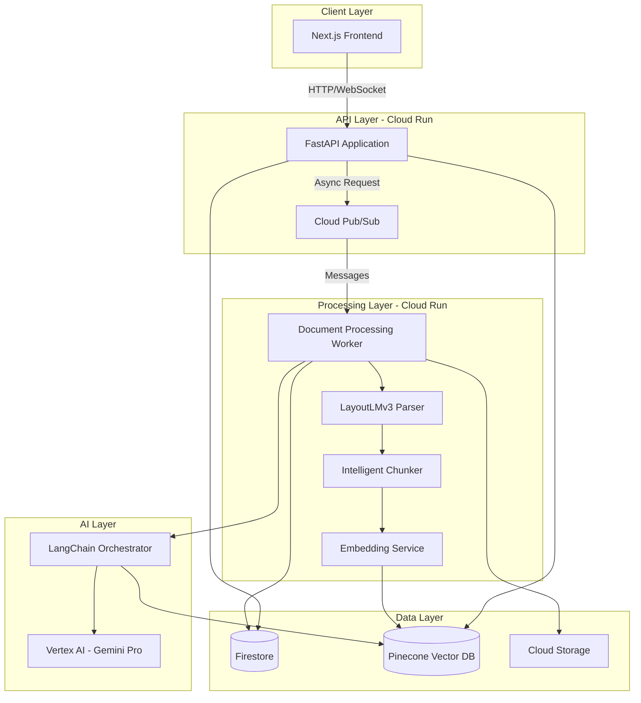

## Component Architecture

### 1. FastAPI Application

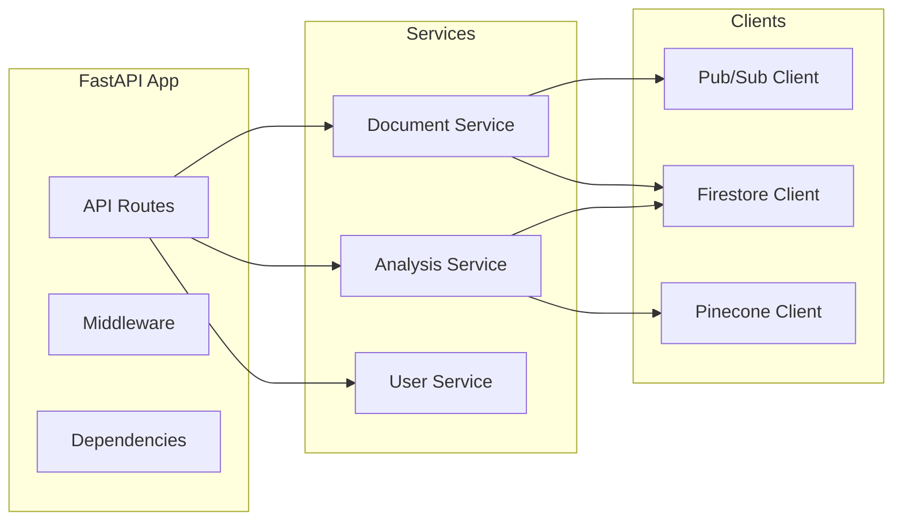

### 2. Document Processing Flow

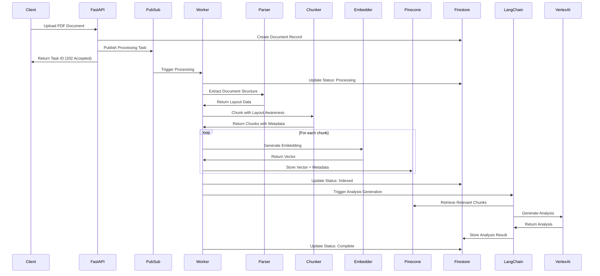

### 3. Intelligent Chunking Strategy

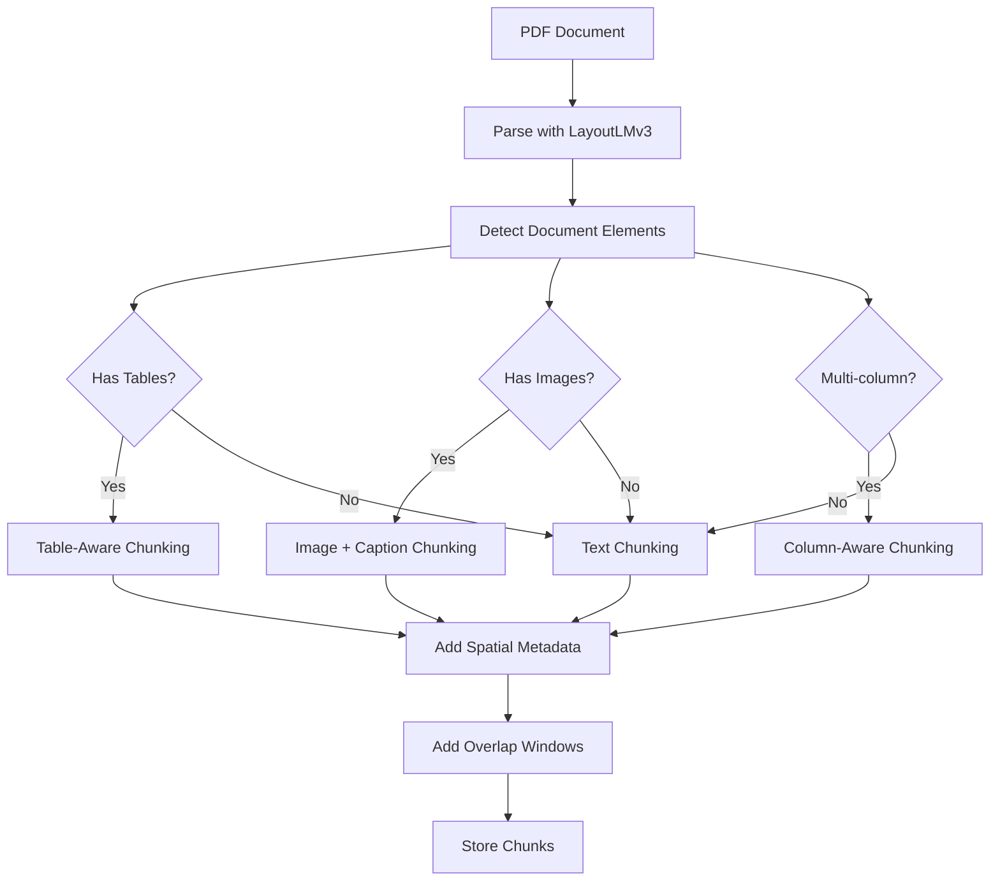

### 4. LangChain Orchestration Flow

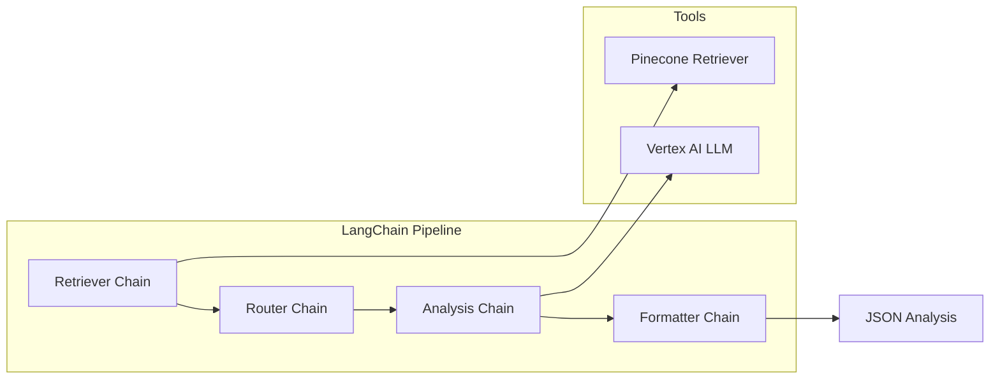

## Data Models

### Firestore Collections

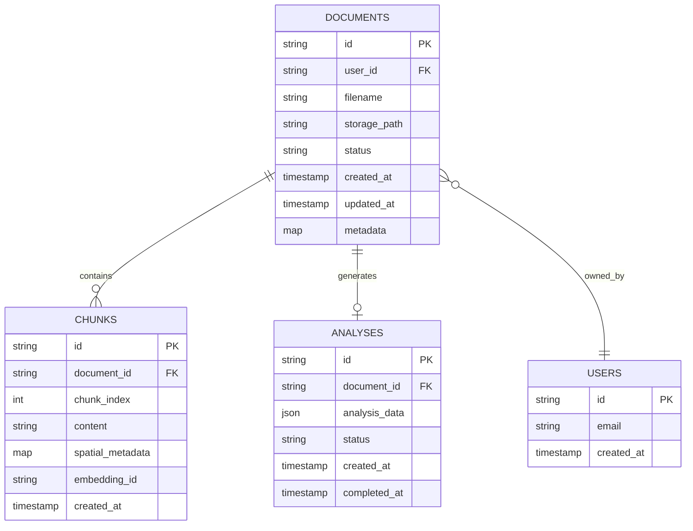

### Document Model (`models/document.py`)

**DocumentStatus Enum:**
- `uploaded`: Document uploaded, awaiting processing
- `processing`: Worker started processing
- `parsing`: PDF parsing in progress
- `chunking`: Document chunking in progress
- `indexing`: Embedding generation and storage
- `indexed`: Document fully indexed
- `analyzing`: Analysis generation in progress
- `complete`: All processing complete
- `failed`: Processing failed

**DocumentType Enum:**
- `zoning`: Zoning maps and regulations
- `risk`: Risk assessment documents
- `permit`: Permit applications and approvals
- `other`: Other real estate documents

**DocumentMetadata:**
- `filename`: Original filename
- `file_size`: File size in bytes
- `mime_type`: MIME type (application/pdf)
- `page_count`: Number of pages
- `tables_count`: Number of tables extracted
- `images_count`: Number of images extracted
- `text_blocks_count`: Number of text blocks
- `document_type`: DocumentType enum
- `upload_source`: Source of upload (e.g., "api", "web")
- `additional_data`: Key-value pairs for extra metadata

**Document:**
- `id`: Unique document identifier (format: `doc_{hex}`)
- `user_id`: User who uploaded the document
- `filename`: Original filename
- `storage_path`: GCS path (format: `gs://bucket/path`)
- `status`: DocumentStatus enum
- `metadata`: DocumentMetadata object
- `created_at`: Creation timestamp
- `updated_at`: Last update timestamp
- `error_message`: Error message if failed
- `processing_started_at`: When processing began
- `processing_completed_at`: When processing completed

### Chunk Model (`models/chunk.py`)

**SpatialMetadata:**
- `page_number`: Page number (1-indexed)
- `element_type`: Type of element (text, table, image)
- `is_table`: Boolean flag for table chunks
- `is_image`: Boolean flag for image chunks
- `coordinates`: Optional bounding box coordinates
- `column_index`: Optional column number for multi-column layouts

**ChunkMetadata:**
- `chunk_index`: Sequential chunk index within document
- `spatial_metadata`: SpatialMetadata object
- `token_count`: Estimated token count
- `word_count`: Word count

**Chunk:**
- `id`: Unique chunk identifier (format: `{document_id}_chunk_{index}`)
- `document_id`: Parent document ID
- `content`: Chunk text content
- `metadata`: ChunkMetadata object
- `created_at`: Creation timestamp

### Analysis Model (`models/analysis.py`)

**AnalysisStatus Enum:**
- `pending`: Analysis queued
- `processing`: Analysis generation in progress
- `complete`: Analysis completed successfully
- `failed`: Analysis generation failed

**PropertyAnalysis:**
- `property_address`: Property address string
- `property_type`: Type of property (e.g., "Residential", "Commercial")
- `zoning_classification`: Zoning code (e.g., "R-1", "C-2")
- `zoning_summary`: Summary of zoning regulations
- `risk_assessment`: Dictionary with risk details (flood, fire, etc.)
- `permit_requirements`: List of required permits
- `restrictions`: List of property restrictions
- `recommendations`: List of recommendations
- `key_findings`: List of key findings
- `compliance_status`: Overall compliance status
- `additional_insights`: Dictionary for extra insights

**AnalysisResult:**
- `analysis`: PropertyAnalysis object
- `source_documents`: List of document IDs used
- `confidence_score`: Confidence score (0.0-1.0)
- `processing_time_seconds`: Time taken to generate
- `llm_model`: Model name used (e.g., "gemini-2.5-pro")
- `tokens_used`: Number of tokens consumed
- `chunks_retrieved`: Number of chunks retrieved

**Analysis:**
- `id`: Unique analysis identifier (format: `analysis_{document_id}_{timestamp}`)
- `document_id`: Document ID this analysis is for
- `status`: AnalysisStatus enum
- `result`: AnalysisResult object (null if not complete)
- `created_at`: Creation timestamp
- `updated_at`: Last update timestamp
- `started_at`: When analysis started
- `completed_at`: When analysis completed
- `error_message`: Error message if failed
- `retry_count`: Number of retry attempts

## API Endpoints

### REST API Structure

#### Document Endpoints
```
POST   /api/v1/documents/upload          # Upload PDF document
GET    /api/v1/documents                 # List documents (with optional user_id filter)
GET    /api/v1/documents/{document_id}   # Get document details and signed URL
GET    /api/v1/documents/{document_id}/status    # Get document processing status
GET    /api/v1/documents/{document_id}/download   # Download original PDF file
DELETE /api/v1/documents/{document_id}   # Delete document and associated data
```

#### Analysis Endpoints
```
GET    /api/v1/documents/{document_id}/analysis  # Get analysis for a document
POST   /api/v1/generate                          # Trigger analysis generation
```

#### System Endpoints
```
GET    /api/v1/health    # Health check endpoint
GET    /                 # Root endpoint with API information
GET    /docs             # OpenAPI/Swagger documentation
GET    /redoc            # ReDoc documentation
```

### API Request/Response Details

**Document Upload:**
- Method: `POST /api/v1/documents/upload`
- Content-Type: `multipart/form-data`
- Parameters:
  - `file`: PDF file (required, max 50MB)
  - `user_id`: User identifier (required)
  - `document_type`: Optional - "zoning", "risk", "permit", or "other"
- Response: `202 Accepted` with document_id and status

**Document Status:**
- Returns current processing stage: `uploaded`, `processing`, `parsing`, `chunking`, `indexing`, `indexed`, `analyzing`, `complete`, `failed`
- Includes progress information with stage and percentage

**Analysis Generation:**
- Method: `POST /api/v1/generate`
- Body: `{ "document_id": "string", "document_type": "optional" }`
- Response: `202 Accepted` with analysis_id and status
- Analysis runs asynchronously; use GET endpoint to check status

## Pub/Sub Topics and Subscriptions

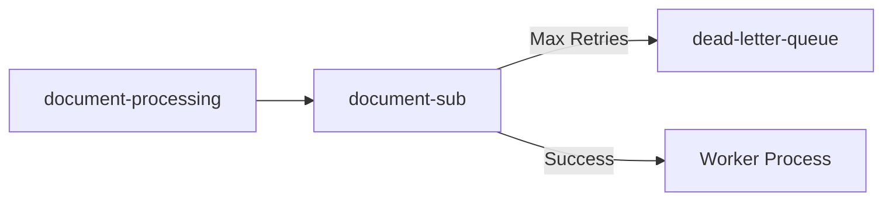

### Message Schema

```json
{
  "document_id": "string",
  "user_id": "string",
  "storage_path": "gs://bucket/path/to/file.pdf",
  "document_type": "zoning|risk|permit",
  "metadata": {
    "filename": "string",
    "uploaded_at": "timestamp"
  }
}
```

## Security Architecture

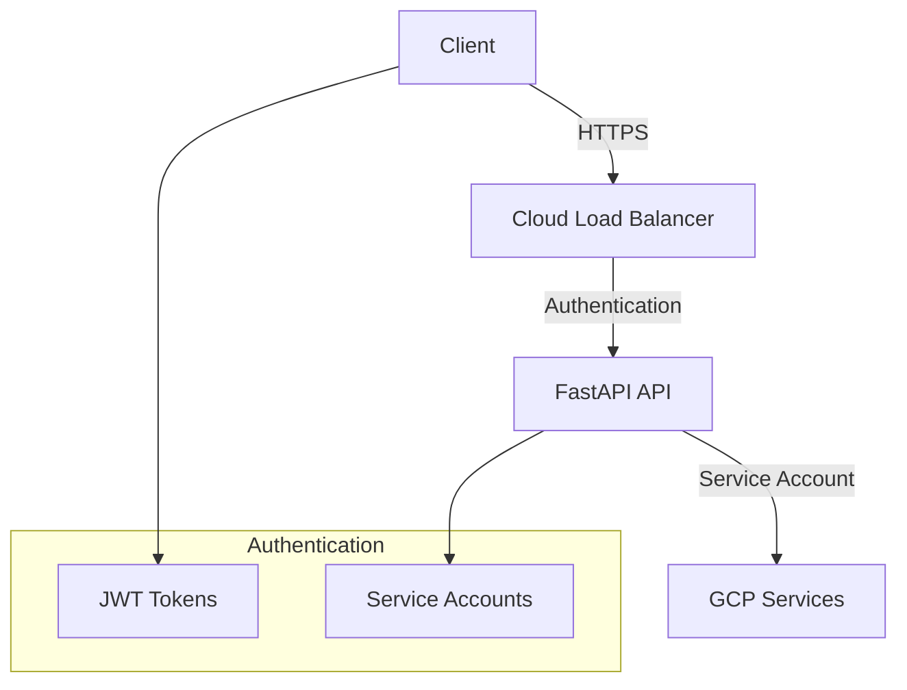

## Scalability Design

### Horizontal Scaling

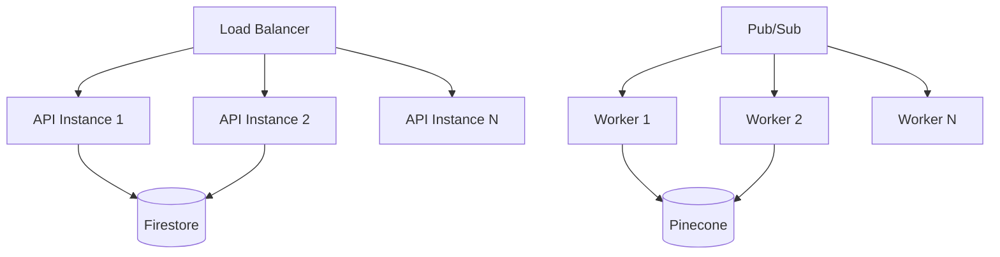

### Auto-scaling Configuration

- **API Service**: Min 1, Max 10 instances, CPU-based scaling
- **Worker Service**: Min 1, Max 20 instances, queue-based scaling
- **Target CPU**: 60%
- **Target Concurrency**: 80 requests per instance

## Error Handling & Resilience

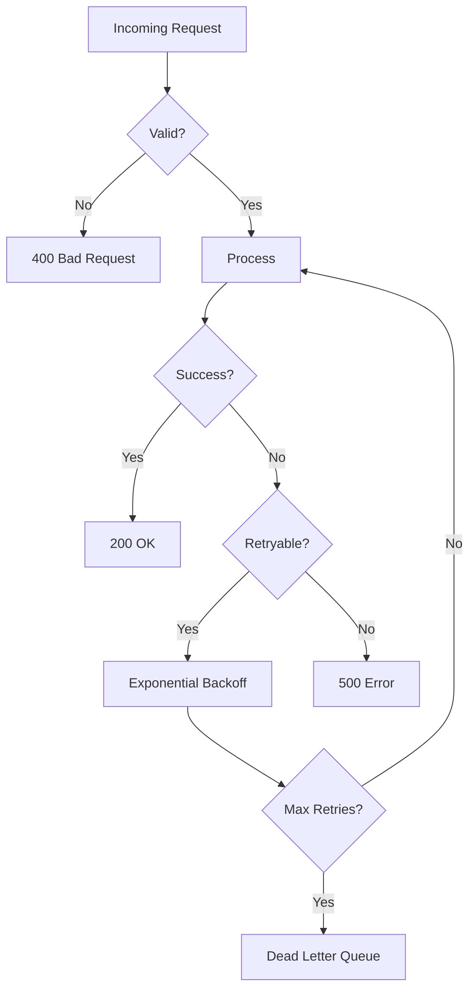

## Monitoring & Observability

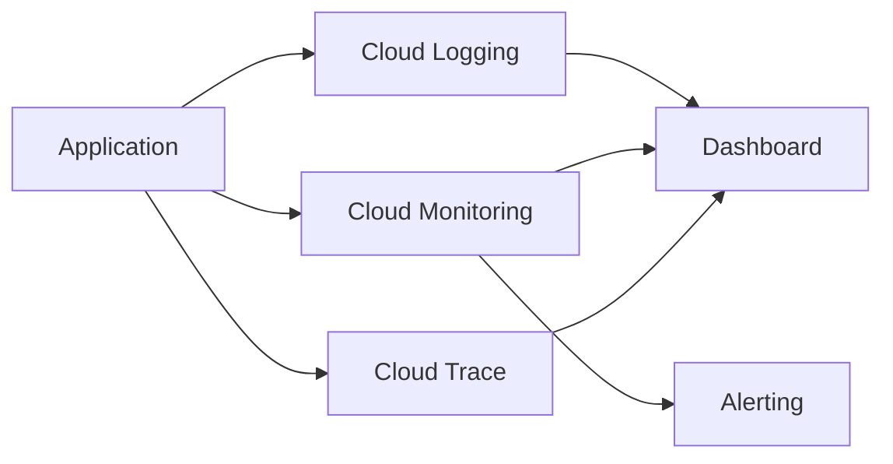

### Key Metrics

- Request latency (p50, p95, p99)
- Error rates (4xx, 5xx)
- Document processing time
- Pub/Sub message processing rate
- Vector search latency
- LLM inference latency

## Cost Optimization

1. **Cloud Run**: Pay per request, auto-scale to zero
2. **Pinecone**: Serverless tier for MVP
3. **Firestore**: On-demand pricing
4. **Vertex AI**: Pay per token
5. **Pub/Sub**: Pay per message

## Technology Choices Rationale

### LangChain over LlamaIndex

**Why LangChain:**
- Better Vertex AI integration
- More flexible prompt management
- Superior chain composition
- Better error handling
- Active community support

**Use Cases:**
- Multi-step reasoning chains
- Tool calling and function execution
- Complex prompt templating
- Retry and fallback logic

### Pinecone for Vector Storage

**Why Pinecone:**
- Serverless, no infrastructure management
- Fast similarity search
- Metadata filtering
- Easy scaling
- Good GCP integration

### FastAPI for API

**Why FastAPI:**
- Native async/await support
- Automatic OpenAPI documentation
- Type validation with Pydantic
- High performance
- Easy testing

### Cloud Run for Deployment

**Why Cloud Run:**
- Serverless, auto-scaling
- Container-based (flexible)
- Pay per use
- Easy CI/CD integration
- Built-in HTTPS

## Service Implementation Details

### LLM Service (`services/llm_service.py`)

**Purpose**: Manages LangChain orchestration with Vertex AI models

**Key Features:**
- Lazy initialization of ChatVertexAI instances
- Configurable temperature, max_tokens, top_p, top_k
- Prompt template creation and chain composition
- Async chain execution with retry logic
- Fallback handling for failed requests

**Default Configuration:**
- Model: `gemini-2.5-pro` (configurable via `VERTEX_AI_MODEL_NAME`)
- Temperature: 0.2 (for analysis), 0.0 (for validation)
- Max Tokens: 4096
- Top-p: 0.95
- Top-k: 40

**Chain Types:**
- Analysis Chain: Multi-step reasoning for property analysis
- Formatting Chain: JSON validation and structure enforcement

### Embedding Service (`services/embedding_service.py`)

**Purpose**: Generates text embeddings using Vertex AI

**Key Features:**
- Model: `text-embedding-005` (latest Vertex AI embedding model)
- Batch processing for multiple texts
- Embedding cache (in-memory) to avoid duplicate API calls
- Async/await support for concurrent operations
- Automatic retry with exponential backoff

**Embedding Dimensions**: 768 (text-embedding-005)

**Caching Strategy**: SHA256 hash of text content as cache key

### PDF Parser (`utils/pdf_parser.py`)

**Implementation**: Configurable parser selection

**Parser Options:**
1. **pdfplumber** (default): Fast, layout-aware PDF parsing
   - Extracts text with position information
   - Handles tables and multi-column layouts
   - Good performance for most documents
   
2. **layoutlmv3**: Advanced ML-based parsing (optional)
   - Uses Hugging Face LayoutLMv3 model
   - Better for complex document structures
   - Requires more resources

**Parser Selection**: Controlled via `PDF_PARSER_TYPE` environment variable

**Parsed Output:**
- Text blocks with spatial coordinates
- Tables with structured data
- Images with captions
- Page-level metadata

### Intelligent Chunker (`utils/chunker.py`)

**Purpose**: Layout-aware document chunking

**Chunking Strategy:**
- Default chunk size: 1000 characters
- Default overlap: 20% (200 characters)
- Minimum chunk size: 100 characters
- Sentence boundary awareness
- Table preservation (tables kept as single chunks)
- Image + caption chunking
- Multi-column layout handling

**Metadata Preservation:**
- Page numbers
- Element types (text, table, image)
- Spatial coordinates
- Chunk indices

## Frontend Architecture

### Next.js 14 App Router Structure

```
frontend/
├── app/
│   ├── layout.tsx          # Root layout with metadata
│   ├── page.tsx            # Homepage with features and CTA
│   ├── globals.css         # Global styles
│   ├── documents/
│   │   └── page.tsx         # Document list and management
│   └── upload/
│       └── page.tsx        # Document upload interface
├── components/
│   ├── DocumentUpload.tsx  # Drag-and-drop upload component
│   ├── DocumentList.tsx    # Document listing with status
│   ├── AnalysisViewer.tsx  # Analysis results display
│   └── ui/                 # Shadcn/ui components
│       ├── button.tsx
│       └── dialog.tsx
└── lib/
    ├── api.ts              # API client with axios
    └── utils.ts            # Utility functions
```

### Frontend Features

**Document Upload:**
- Drag-and-drop interface
- File validation (PDF only, max 50MB)
- Upload progress tracking
- Document type selection (zoning, risk, permit, other)
- Real-time status updates

**Document Management:**
- List view with status indicators
- Document details with signed URLs
- Download original PDFs
- Delete documents
- Status polling for processing updates

**Analysis Viewer:**
- Structured analysis display
- Property information
- Zoning classification
- Risk assessments
- Permit requirements
- Recommendations and key findings

### API Client (`lib/api.ts`)

**Features:**
- Axios-based HTTP client
- TypeScript type definitions
- Error handling
- Upload progress tracking
- Environment-based base URL configuration

**API Functions:**
- `uploadDocument()`: Upload with progress callback
- `getDocument()`: Retrieve document details
- `getDocumentStatus()`: Check processing status
- `listDocuments()`: List user documents
- `deleteDocument()`: Remove document
- `getAnalysis()`: Retrieve analysis results
- `generateAnalysis()`: Trigger analysis generation

## Configuration & Environment Variables

### Backend Configuration (`config.py`)

**Required Variables:**
```bash
GCP_PROJECT_ID=your-project-id
STORAGE_BUCKET_NAME=your-bucket-name
PINECONE_API_KEY=your-pinecone-key
API_SECRET_KEY=your-secret-key
```

**Optional Variables:**
```bash
GCP_REGION=us-central1                    # Default: us-central1
FIRESTORE_DATABASE_ID=(default)            # Default: (default)
PINECONE_INDEX_NAME=realestate-documents   # Default: realestate-documents
PUBSUB_TOPIC_NAME=document-processing     # Default: document-processing
VERTEX_AI_MODEL_NAME=gemini-2.5-pro       # Default: gemini-2.5-pro
CORS_ORIGINS=http://localhost:3000          # Comma-separated list
LOG_LEVEL=INFO                             # DEBUG, INFO, WARNING, ERROR, CRITICAL
PDF_PARSER_TYPE=pdfplumber                 # pdfplumber or layoutlmv3
```

**Pinecone Configuration:**
- For serverless indexes: `HOST` (index host URL)
- For pod-based indexes: `PINECONE_ENVIRONMENT` or `REGION`

### Frontend Configuration

**Required Variables:**
```bash
NEXT_PUBLIC_API_URL=http://localhost:8000/api/v1
```

## Middleware & Request Handling

### Request ID Middleware

**Purpose**: Trace requests across services for debugging and monitoring

**Implementation:**
- Generates UUID for each request (or extracts from `X-Request-ID` header)
- Adds request ID to request state
- Includes request ID in response headers
- Logs include request ID for correlation

**Benefits:**
- Request tracing across distributed system
- Easier debugging of failed requests
- Performance monitoring per request

### Error Handling

**Global Exception Handler:**
- Catches unhandled exceptions
- Returns structured error responses
- Includes request ID in error response
- Logs full stack traces

**Error Response Format:**
```json
{
  "error": "ErrorType",
  "detail": "Human-readable error message",
  "request_id": "uuid",
  "timestamp": "ISO 8601 timestamp"
}
```

**HTTP Status Codes:**
- `200 OK`: Success
- `202 Accepted`: Async operation started
- `400 Bad Request`: Validation error
- `403 Forbidden`: Authorization failure
- `404 Not Found`: Resource not found
- `413 Request Entity Too Large`: File too large
- `500 Internal Server Error`: Server error

## Document Status Flow

```
uploaded → processing → parsing → chunking → indexing → indexed → analyzing → complete
                                                                              ↓
                                                                          failed
```

**Status Descriptions:**
- `uploaded`: Document uploaded, waiting for processing
- `processing`: Worker started processing
- `parsing`: PDF being parsed
- `chunking`: Document being chunked
- `indexing`: Embeddings being generated and stored
- `indexed`: Document fully indexed, ready for analysis
- `analyzing`: Analysis generation in progress
- `complete`: Processing and analysis complete
- `failed`: Processing failed (error_message contains details)

